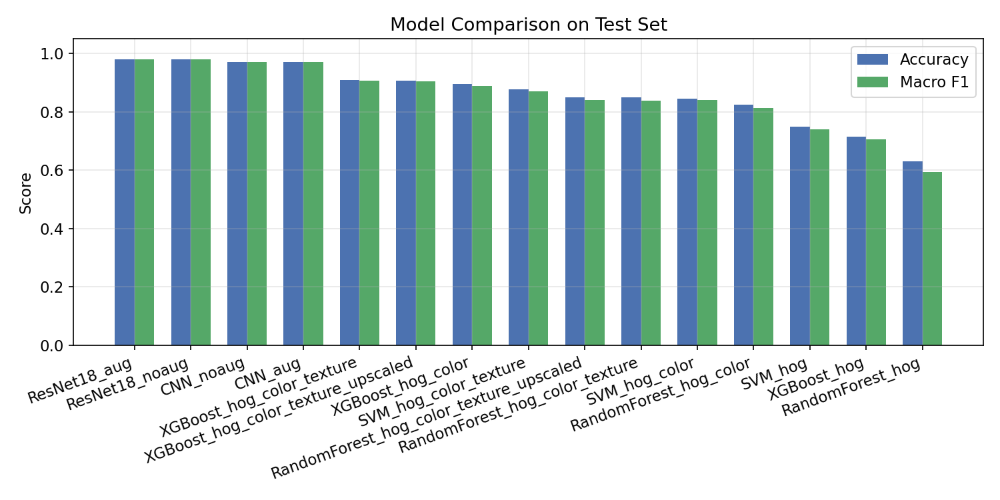
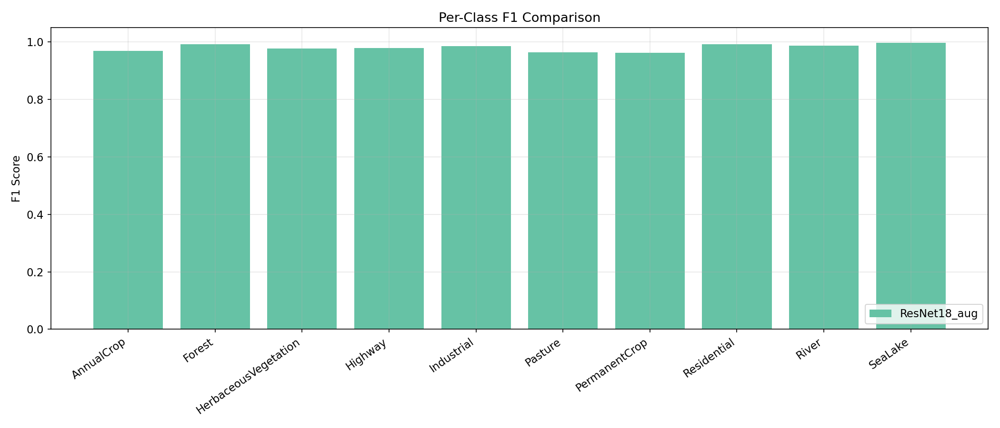
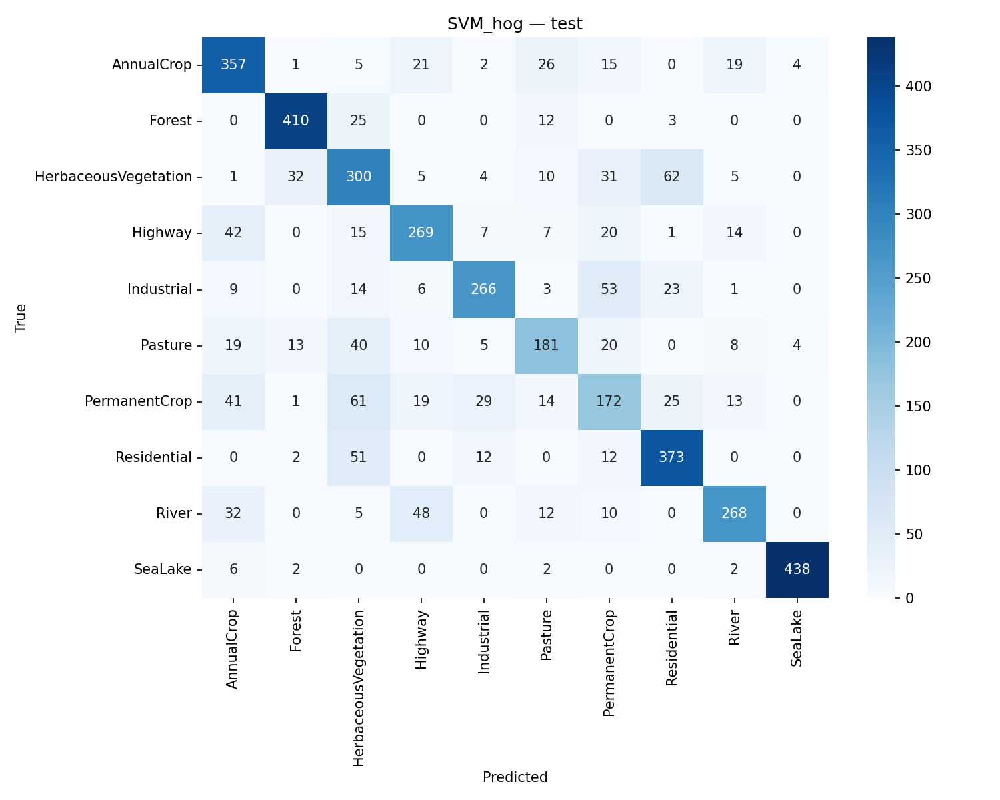
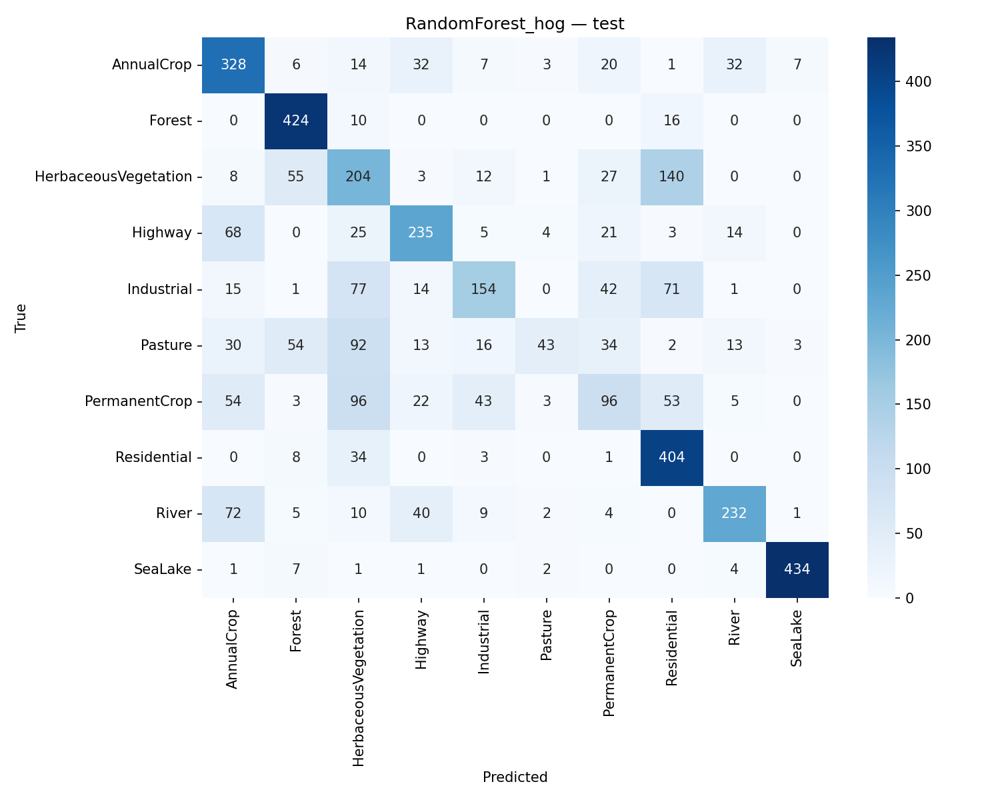

# Progress Report
## Comparative Land Cover Classification on EuroSAT Benchmark

**Course:** CS-464  
**Section:** 1  
**Group:** 8  

**Team Members:**
- Ferit Bilgi (22102554) – ferit.bilgi@ug.bilkent.edu.tr
- Berke İsmail Erhan Asıl (22203732) – ismail.asil@ug.bilkent.edu.tr
- Talha Berktan Baş (22301666) – berktan.bas@ug.bilkent.edu.tr
- Berhan Kıyanus (22203742) – berhan.kiyanus@ug.bilkent.edu.tr
- Hasan Mert İncesesli (22202350) – mert.incesesli@ug.bilkent.edu.tr

---

## 1. Introduction
Land use and land cover classification from satellite imagery is a core task in remote sensing and environmental monitoring. Practical applications include urban growth tracking, agricultural planning, disaster response, and ecological assessment. The quality of automated classification directly influences downstream policy and operational decisions; therefore, model robustness and interpretability are both important.

In this project, we investigate multi-class classification on the EuroSAT RGB benchmark and compare classical machine learning (ML) methods with deep learning (DL) methods. Our objective is to measure predictive performance under standard clean conditions, and to analyze model behavior under synthetic image degradations that mimic real-world acquisition issues such as blur, noise, and reduced spatial resolution.

The study is designed to produce a reproducible pipeline with clear experimental stages: data ingestion and split management, feature extraction (for ML), model training, evaluation, robustness testing, and result summarization. The implementation includes both modular source code and executable scripts for end-to-end runs.

---

## 2. Dataset
### 2.1 Dataset Analysis
We use the EuroSAT RGB dataset, which contains 27,000 satellite image patches distributed across 10 classes:

- AnnualCrop
- Forest
- HerbaceousVegetation
- Highway
- Industrial
- Pasture
- PermanentCrop
- Residential
- River
- SeaLake

The current project setup verifies all 10 classes and all 27,000 images in the expected directory structure. Images are stored in per-class folders, which naturally support supervised classification. The dataset exhibits common remote sensing challenges:

- **Inter-class similarity:** some classes may share visual texture/color characteristics.
- **Intra-class variance:** within-class appearance changes due to seasonal and illumination effects.
- **Scale and context limitations:** patches are small and may not contain complete semantic context.

### 2.2 Dataset Preprocessing
The pipeline uses stratified splitting to preserve class balance across train/validation/test partitions:

- Train: 70%
- Validation: 15%
- Test: 15%

For classical ML pipelines, images are resized to 64x64 before handcrafted feature extraction. For DL pipelines, images are resized to 224x224 and normalized with ImageNet statistics to match ResNet pretraining assumptions.

The code saves split metadata (`split_train.csv`, `split_val.csv`, `split_test.csv`) and class-index mapping (`class_names.json`) for strict reproducibility across runs.

---

## 3. Coding Environment
### 3.1 Tools and Libraries
The implementation is in Python and uses:

- **scikit-learn** for classical ML models and hyperparameter search
- **PyTorch + torchvision** for deep learning and transfer learning
- **OpenCV + scikit-image** for preprocessing and handcrafted features
- **pandas/numpy** for data handling and numerical operations
- **matplotlib/seaborn** for evaluation and publication-style plotting
- **PyYAML** for configuration-driven experimentation

### 3.2 Repository and Script Structure
The project is organized as:

- `run_ml.py`: Classical ML pipeline entry script
- `run_dl.py`: DL pipeline entry script
- `run_robustness.py`: Degradation-based robustness evaluation
- `summarize_results.py`: Aggregates metrics and generates comparison plots
- `src/`: reusable modules (`data`, `features`, `ml`, `dl`, `robustness`, `evaluation`)
- `configs/`: YAML files for experiment settings

This organization supports both reproducibility and incremental experimentation.

---

## 4. Details of Trained Models
### 4.1 Classical ML Models
The planned classical models are:

1. **Support Vector Machine (SVM)**
2. **Random Forest (RF)**
3. **XGBoost** (with Logistic Regression fallback if XGBoost is unavailable)

For ML models, handcrafted feature ablation is implemented:

- `hog`
- `hog_color`
- `hog_color_texture`

#### Why these models?
- **SVM** is effective in high-dimensional feature spaces and can model non-linear decision boundaries.
- **RF** is robust, handles non-linear relations, and offers strong baseline performance with low tuning burden.
- **XGBoost** captures complex interactions through boosted trees and often performs strongly on engineered features.

### 4.2 Deep Learning Model
The DL model is **ResNet18**, optionally initialized with ImageNet pretrained weights and fine-tuned for 10-way classification.

#### Why ResNet18?
- Residual connections stabilize optimization in deeper networks.
- Transfer learning improves convergence and data efficiency.
- ResNet18 provides a good accuracy/computation tradeoff for this phase.

### 4.3 Hyperparameter Effects (Conceptual)
- **SVM (C, kernel):** controls margin softness and decision boundary flexibility.
- **RF (n_estimators, max_depth):** controls bias-variance tradeoff and ensemble capacity.
- **XGBoost (depth, learning rate, estimators):** controls additive model complexity and convergence.
- **DL (learning rate, weight decay, batch size, scheduler, early stopping):** affects optimization stability, overfitting, and final generalization.

---

## 5. Experimental Setup
The implemented framework supports:

- Stratified data split management with metadata persistence
- Config-driven training through YAML files
- Randomized hyperparameter search for ML models
- Early stopping and LR scheduling for DL training
- Standardized metric collection (accuracy, macro precision/recall/F1)
- Confusion matrix and per-class report generation

### Current Progress-State Experiment
At the current reporting stage, we completed a stable end-to-end ML run on the full EuroSAT split (70/15/15) for two baseline models under the HOG feature setting:

- **SVM + HOG**
- **Random Forest + HOG**

The objective of this stage is to establish a reproducible baseline with validated outputs (metrics files, confusion matrices, and comparison plots) before launching the full ablation matrix (additional feature modes, DL training, and robustness evaluation).

These results should be interpreted as **preliminary benchmark evidence** for the progress checkpoint, not as final model rankings for the end-of-term submission.

---

## 6. Results (Current Progress Snapshot)
At this stage, the following milestones are completed and validated:

- Environment setup and dependency validation
- Dataset verification (27,000 images, 10 classes)
- Reproducible stratified split generation and persistence
- End-to-end ML training/evaluation for two baseline models
- Automatic generation of confusion matrices and comparison plots

### 6.1 Quantitative Test Results

Current test-set summary from `results/metrics/overall_test_summary.csv`:

| Model | Accuracy | Macro-Precision | Macro-Recall | Macro-F1 |
|---|---:|---:|---:|---:|
| RandomForest_hog | 0.6232 | 0.6189 | 0.5976 | 0.5862 |
| SVM_hog | 0.5958 | 0.5875 | 0.5800 | 0.5809 |

At this checkpoint, **RandomForest_hog** provides the strongest overall performance among the completed runs.

### 6.2 Visual Results

Figure 1: Model-level comparison (Accuracy and Macro-F1)

Figure 2: Per-class F1 comparison

Figure 3: Test confusion matrix for SVM_hog

Figure 4: Test confusion matrix for RandomForest_hog

### 6.3 Interpretation

- The pipeline has moved beyond smoke testing and now produces stable, reportable benchmark outputs.
- Class-level behavior is inspectable through confusion matrices and per-class F1 visualizations.
- Current comparisons are intentionally scoped to baseline ML settings; they provide a credible reference point for upcoming DL and robustness analyses.

---

## 7. Future Work
Remaining tasks for final delivery:

1. Expand ML experiments to remaining feature modes (`hog_color`, `hog_color_texture`) and complete model matrix
2. Run full DL training (ResNet18 with/without augmentation)
3. Run robustness experiments under configured degradations (blur, noise, downsampling)
4. Integrate DL and robustness outputs into unified final comparison tables
5. Extend error analysis with cross-model class confusion trends
6. Final report polishing and limitations discussion

Additionally, we plan to include a concise discussion on computational cost and training-time tradeoffs between ML and DL settings.

---

## 8. Workload Distribution
The current implementation and reporting tasks were distributed explicitly across team members as follows:
n
- **Talha Berktan Baş (22301666):** Implemented core model-side code components, including the main ML/DL model pipeline structure and related training/evaluation flow modules used by the runnable scripts.
- **Berke İsmail Erhan Asıl (22203732):** Executed model training runs, generated result tables and summary artifacts, exported visual outputs, and integrated the produced figures/tables into the report/PDF deliverables.
- **Berhan Kıyanus (22203742):** Implemented and refined model-related code for the classical ML track (feature/model experimentation support), and contributed to evaluation-side script improvements.
- **Ferit Bilgi (22102554):** Managed dataset organization and reproducibility workflow (data/split checks, metadata consistency, run readiness), and supported experiment orchestration and validation.
- **Hasan Mert İncesesli (22202350):** Led report writing/editing, section organization, and final progress-report narrative consistency (results interpretation, formatting, and submission preparation).

This distribution will be finalized in the end-of-term report with any additional experiment ownership updates (DL full runs and robustness stage).

---

## 9. References
1. Helber, P., Bischke, B., Dengel, A., & Borth, D. (2018). *EuroSAT: A Novel Dataset and Deep Learning Benchmark for Land Use and Land Cover Classification*. Zenodo. Available: https://zenodo.org/records/7711810

2. Pedregosa, F. et al. (2011). *Scikit-learn: Machine Learning in Python*. Journal of Machine Learning Research.

3. He, K., Zhang, X., Ren, S., & Sun, J. (2016). *Deep Residual Learning for Image Recognition*. CVPR.

---

## Appendix A: Experimental Output Artifacts (Progress Stage)

This appendix presents all experiment outputs produced at the current progress milestone. Artifacts are organized into three categories: quantitative metrics, per-class breakdowns, and visual outputs. All files are stored under the `results/` directory within the project repository.

> **Note:** This appendix reflects the state of the pipeline at the progress reporting stage. The full experiment set (additional feature modes, DL training, robustness evaluation) will be appended in the final report submission.

---

### A.1 Overall Test Performance

The following table summarizes test-set performance for the two models trained to date, produced by `summarize_results.py` from `results/metrics/overall_test_summary.csv`:

| Model | Accuracy | Macro-Precision | Macro-Recall | Macro-F1 |
|---|---:|---:|---:|---:|
| RandomForest_hog | 0.6232 | 0.6189 | 0.5976 | 0.5862 |
| SVM_hog | 0.5958 | 0.5875 | 0.5800 | 0.5809 |

Both models were trained on the full EuroSAT training split (18,900 samples) using HOG features with a stratified 70/15/15 partition.

---

### A.2 Per-Class Performance Breakdown

The following tables are drawn from the per-model classification reports stored in `results/metrics/`.

**Table A.2.1 — SVM_hog (Test Set)**

| Class | Precision | Recall | F1-Score | Support |
|---|---:|---:|---:|---:|
| AnnualCrop | 0.518 | 0.620 | 0.564 | 450 |
| Forest | 0.804 | 0.849 | 0.826 | 450 |
| HerbaceousVegetation | 0.360 | 0.476 | 0.410 | 450 |
| Highway | 0.529 | 0.533 | 0.531 | 375 |
| Industrial | 0.615 | 0.576 | 0.595 | 375 |
| Pasture | 0.471 | 0.400 | 0.432 | 300 |
| PermanentCrop | 0.363 | 0.261 | 0.304 | 375 |
| Residential | 0.707 | 0.660 | 0.683 | 450 |
| River | 0.534 | 0.456 | 0.492 | 375 |
| SeaLake | 0.973 | 0.969 | 0.971 | 450 |
| **Macro avg** | **0.587** | **0.580** | **0.581** | 4050 |

**Table A.2.2 — RandomForest_hog (Test Set)**

| Class | Precision | Recall | F1-Score | Support |
|---|---:|---:|---:|---:|
| AnnualCrop | 0.581 | 0.724 | 0.645 | 450 |
| Forest | 0.724 | 0.931 | 0.814 | 450 |
| HerbaceousVegetation | 0.360 | 0.427 | 0.391 | 450 |
| Highway | 0.680 | 0.619 | 0.648 | 375 |
| Industrial | 0.572 | 0.392 | 0.465 | 375 |
| Pasture | 0.605 | 0.173 | 0.269 | 300 |
| PermanentCrop | 0.364 | 0.224 | 0.277 | 375 |
| Residential | 0.571 | 0.898 | 0.698 | 450 |
| River | 0.755 | 0.624 | 0.683 | 375 |
| SeaLake | 0.977 | 0.964 | 0.971 | 450 |
| **Macro avg** | **0.619** | **0.598** | **0.586** | 4050 |

**Observations:** Both models achieve strong performance on spectrally distinct classes (SeaLake: F1 ~0.97, Forest: F1 ~0.81–0.83). The most difficult classes are PermanentCrop and HerbaceousVegetation, which are visually similar to AnnualCrop and Pasture respectively, leading to lower recall values.

---

### A.3 Model Comparison Plot

Figure A.1 shows accuracy and macro-F1 side-by-side for all trained models at this stage.

*Figure A.1 — Test-set accuracy and macro-F1 for SVM_hog and RandomForest_hog.*

---

### A.4 Per-Class F1 Visualization

Figure A.2 shows the breakdown of F1 per class for both models, allowing direct class-level comparison.

*Figure A.2 — Per-class F1 scores across models. SeaLake and Forest consistently outperform other categories; PermanentCrop and HerbaceousVegetation remain the most challenging.*

---

### A.5 Confusion Matrices

Figures A.3 and A.4 show the test-set confusion matrices for SVM_hog and RandomForest_hog respectively.

*Figure A.3 — SVM_hog test confusion matrix. Notable confusion: HerbaceousVegetation ↔ AnnualCrop, PermanentCrop ↔ AnnualCrop.*

*Figure A.4 — RandomForest_hog test confusion matrix. Higher recall for AnnualCrop and Residential but reduced precision for Pasture.*

---

### A.6 Reproducibility

Split metadata and trained model checkpoints are stored for exact reproducibility:

- `results/logs/split_train.csv`, `split_val.csv`, `split_test.csv` — image paths and labels per partition
- `results/logs/class_names.json` — class-to-index mapping
- `results/models/SVM_hog.pkl` — trained SVM pipeline (scikit-learn joblib)
- `results/models/RandomForest_hog.pkl` — trained Random Forest pipeline

---

### A.7 Planned Additions for Final Submission

The following outputs will be added as the remaining experiments are completed:

| Artifact | Source |
|---|---|
| Full ML ablation table (hog_color, hog_color_texture feature modes) | `run_ml.py` |
| DL training curves (ResNet18 ± augmentation) | `run_dl.py` |
| DL confusion matrices and test report | `run_dl.py` |
| Robustness result table (blur/noise/downsample) | `run_robustness.py` |
| Robustness comparison figure | `summarize_results.py` |
